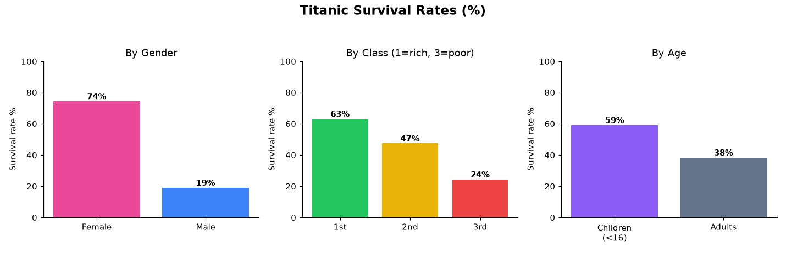

# 🚢 Titanic Survival Analysis

A data-analysis project exploring **who survived the Titanic disaster, and why** — using real passenger data (891 passengers). The goal: turn raw data into clear, evidence-backed insights.

**Tools used:** Excel (pivot tables) · Python (pandas) · SQL — the same analysis was performed in all three to confirm the results.

---

## 📋 The data
891 passengers from the RMS Titanic. Key columns: `Survived` (0/1), `Pclass` (ticket class: 1 = rich → 3 = poor), `Sex`, `Age`, `Fare`.

**Overall survival rate: 38.4%** (342 of 891 passengers survived).

---

## 🔑 Key findings

### 1. Gender was the biggest survival factor
Women were nearly **4× more likely** to survive than men.
- **Women: 74.2% survived** vs **Men: 18.9%**
- **What it means:** the "women and children first" evacuation protocol was clearly followed — gender, more than anything else, decided who lived.

### 2. Children survived at a higher rate than adults
- **Children (under 16): 59.0% survived** vs **Adults: 38.2%**
- **What it means:** this confirms the *"and children"* part of the protocol — being young meaningfully improved survival odds.

### 3. Wealth (class) strongly affected survival
A clear staircase — the richer the passenger, the higher the survival rate.
- **1st class: 63.0%** → **2nd class: 47.3%** → **3rd class: 24.2%**
- **What it means:** the data shows class mattered, but the likely *cause* is **access** — 1st-class cabins were on the upper decks, near the lifeboats and evacuation, while 3rd class was deep below.

---

## ⚠️ Honest caveats
- This analysis shows **what** happened (the patterns), not the exact **why** — the causes (e.g. cabin location, evacuation priority) are reasoned from context, not proven by the data alone.
- Class and gender may be **linked** (e.g. more women in 1st class), so the effects aren't fully independent — a deeper analysis would separate them.

## 🎯 Conclusion
Survival on the Titanic was **not random** — it was strongly driven by **gender, age, and wealth**, in that order. A passenger's best odds came from being a **woman**, a **child**, or **wealthy**; the worst odds belonged to **adult men in 3rd class**.

---

*Analysis by **Jai Mehta** · verified across Excel, Python (pandas), and SQL.*
